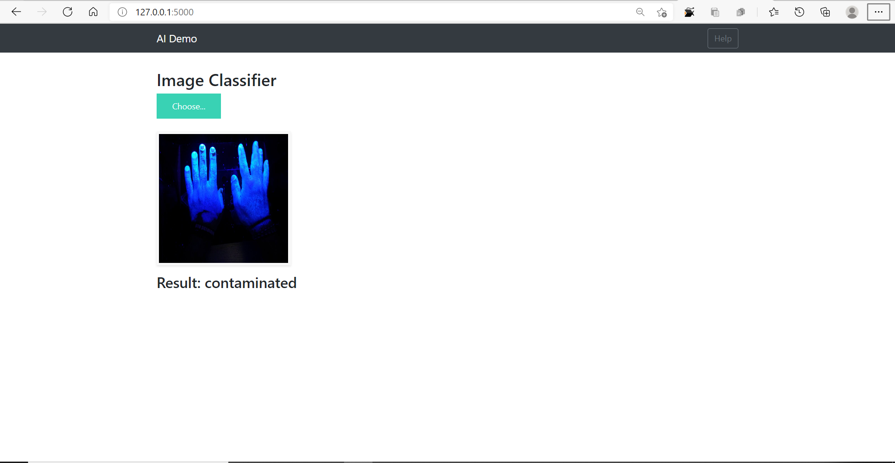

# Blacklight-Images-Classification
In this project I have created a CNN classification model. This project classifies if a black light image is contaminated or not contaminated.

# Dataset
This is the blacklight + non-blacklight images [dataset](https://www.kaggle.com/nandinibagga/black-light-images-non-blacklight-images) that I used.

# Demo Website

